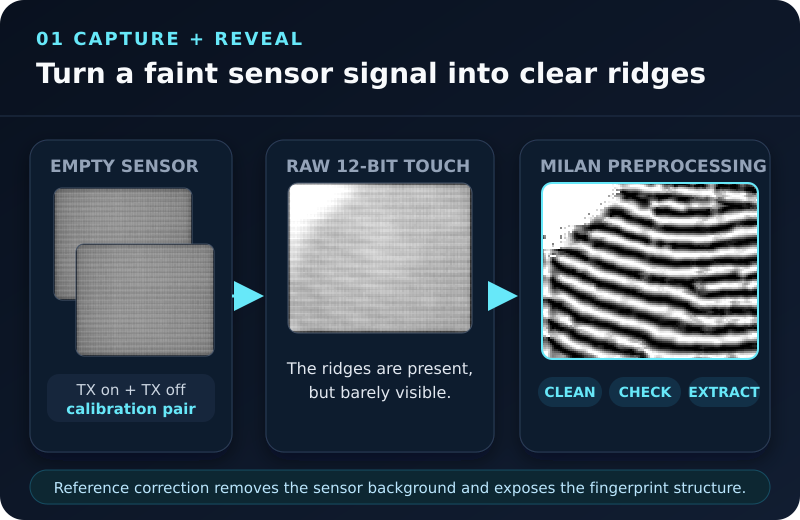
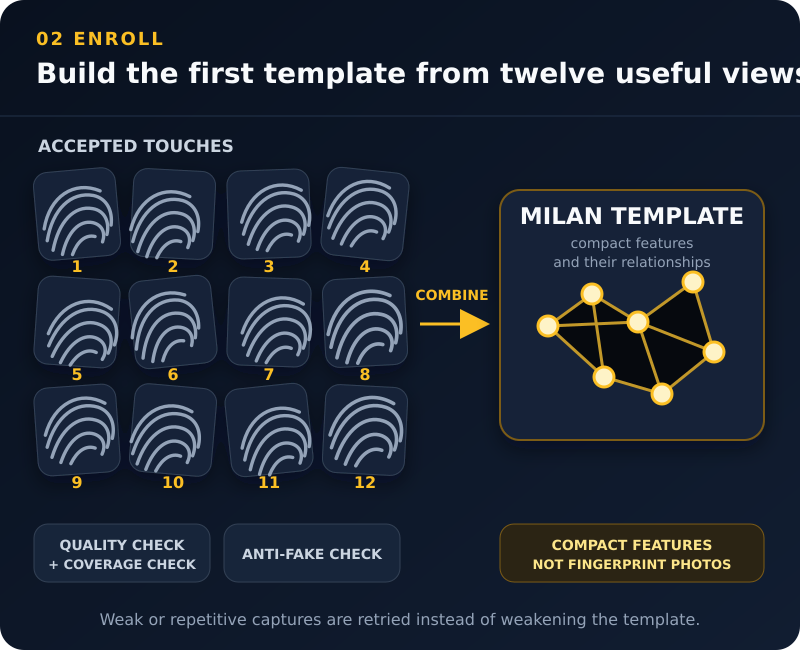
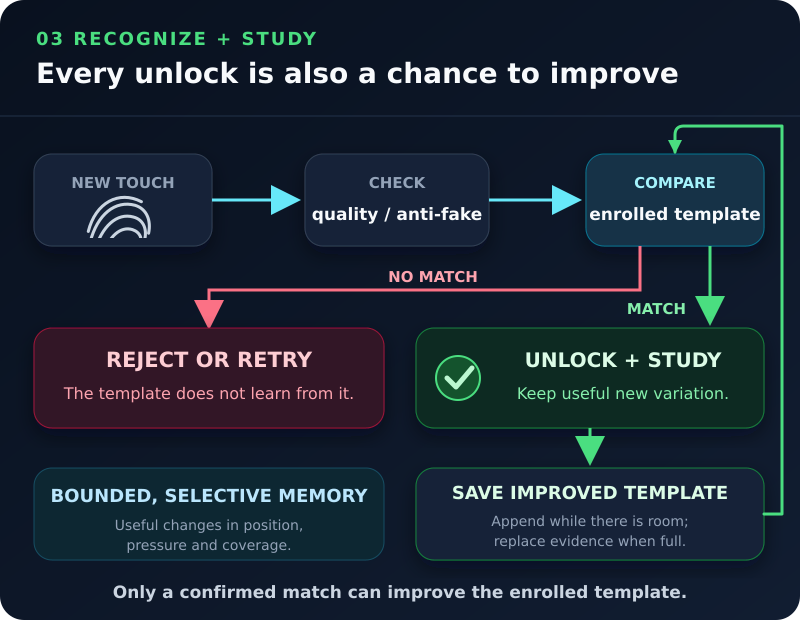

# Goodix 53x5 libfprint Driver

**A native Linux implementation of Goodix's Windows Milan biometric stack,
reverse-engineered and validated byte for byte.**

This out-of-tree libfprint driver supports Goodix HTK32 USB fingerprint sensors
with IDs `27c6:5335`, `27c6:5385`, and `27c6:5395`. It implements the sensor
protocol, image processing, enrollment, matching, anti-fake processing, and
adaptive template updates without requiring Windows or proprietary Goodix
binaries at runtime.

> [!IMPORTANT]
> All development in this repository was performed with AI assistance. The
> implementation is tested against the native Windows Milan behavior with
> deterministic, byte-level parity checks; generated code is not treated as
> evidence of correctness by itself.

## Supported Hardware

The project is currently validated on a **Dell XPS 13 9305** with a
`27c6:5335` sensor. IDs `27c6:5385` and `27c6:5395` are registered by the driver
but have not received the same hardware validation.

Before installing on an unlisted Goodix USB device, run:

```sh
sudo ./scripts/goodix53x5-detect.sh
```

If it reports `COMPATIBLE CANDIDATE`, either:

- [Open a compatibility issue](https://github.com/seaweeduk/goodix53x5-libfprint/issues/new)
  with its output, your laptop model, and Linux distribution; or
- Submit a PR adding the ID to `drivers/goodix53x5/goodix53x5.c` and the Goodix
  entries in `meson-integration.patch`, with probe and hardware-test results.

> [!NOTE]
> On the same challenging dataset, Milan's adaptive learning raised the
> genuine-accept rate from roughly **82.5-85% before learning** to **98.5% and
> 99% in learned runs**, with **zero false accepts** in those runs. This indicates
> that template study and updates contribute significantly over time. These are
> project experiments, not certification results or guarantees for other
> hardware and datasets.

## How Milan Works

The sensor sends encrypted 108 x 88, 12-bit capacitive images over USB. Milan
turns those small captures into a fingerprint template that can improve after
successful matches.



**Capture and reveal.** Empty reference frames describe the sensor itself.
Milan uses that baseline to remove the sensor background, expose ridge detail,
check the image, and extract a compact fingerprint representation.



**Build the first template.** Enrollment collects twelve accepted touches.
Different positions and pressure reveal different parts of the finger; weak or
repetitive captures are retried. The resulting template stores extracted
features and their relationships, not a gallery of fingerprint photographs.



**Recognize and improve.** A new touch is checked against the enrolled
template. Rejected scans never teach the system. After a confirmed match, Milan
can retain useful new variation and save the improved template for future
unlocks. The template has a fixed capacity, so new evidence is appended while
space remains and can replace existing evidence once it is full.

Under the hood, the driver initializes the sensor and its GTLS session,
calibrates finger detection, runs Milan preprocessing and anti-fake checks,
extracts and relates features, performs matching and study, then stores the
result through libfprint. Successful learning updates are persisted by the
paired fprintd build.

The Milan implementation was reconstructed from the native Windows behavior.
The reference DLL is used only as a private interoperability oracle and is not
included in, discovered by, or required to run this repository.

## Install

The supported installation builds pinned libfprint `v1.94.10` and fprintd
`v1.94.5` sources, then installs them as an isolated paired stack under
`/opt/goodix53x5-milan`:

If upgrading from the retired sigfm matcher, delete existing prints before
switching implementations, then re-enroll after installation:

```sh
fprintd-delete "$USER"
```

```sh
./install.sh
```

The installer does not overwrite distribution files under `/usr`. It adds a
managed systemd drop-in so fprintd uses the paired stack while keeping print
state in `/var/lib/fprint`.

Build dependencies include a C toolchain, Git, Meson, Ninja, pkg-config,
GLib/GIO, GUsb, OpenSSL 3, and the development dependencies required by
libfprint and fprintd, including Polkit's GObject library.

For stack layout, build controls, status checks, and rollback behavior, see the
[Milan stack guide](scripts/MILAN-STACK.md).

## Enroll And Verify

Use your desktop environment's fingerprint settings or fprintd directly:

```sh
fprintd-enroll
fprintd-verify
```

## Windows Dual Boot

Normal Linux-only installations retain the automatic all-zero PSK setup. An
optional Windows key file enables shared-key operation without changing the
default path. See the [Windows dual-boot migration guide](WINDOWS-DUAL-BOOT.md).

## Limitations And Security

- This is an experimental, out-of-tree driver tied to pinned libfprint and
  fprintd revisions.
- Hardware validation currently covers only the Dell XPS 13 9305 with the
  `27c6:5335` sensor.
- Fingerprint images and matching are handled on the host. This is not a
  match-on-chip or secure-element design.
- A plaintext imported GTLS key is protected by filesystem permissions, not a
  TPM or DPAPI. Do not publish it or commit it to a repository.
- A compromised root or kernel environment can bypass authentication or access
  biometric data. Fingerprint unlock should be treated as a convenience factor,
  not the only protection for sensitive data.

## Development

Release builds exclude capture writers and parity diagnostics. The complete
opt-in procedure for collecting private biometric debug data is kept in the
[debug capture guide](DEBUG-CAPTURE-GUIDE.md), not in this README.

The [Milan parity harness](tools/milan-parity/README.md) documents the retained
byte-parity contracts and replay tooling.

## Uninstall

Remove only the managed shadow stack and systemd drop-in:

```sh
./uninstall.sh
```

Saved fingerprints under `/var/lib/fprint` are left in place.

## Credits

- [Berkekbgz](https://github.com/berkekbgz) for reversing the native Chicago
  matcher in [libfprint-goodix-spi](https://github.com/berkekbgz/libfprint-goodix-spi)
  and for his advice
- [AndyHazz](https://github.com/AndyHazz) for the original
  [Goodix 53x5 libfprint driver](https://github.com/AndyHazz/goodix53x5-libfprint),
  from which this repository was forked
- Protocol research and earlier Goodix Linux work from
  [goodix-fp-linux-dev](https://github.com/goodix-fp-linux-dev)
- libfprint and fprintd from the
  [freedesktop.org fingerprint stack](https://fprint.freedesktop.org/)

## License

LGPL-2.1-or-later, matching libfprint.
